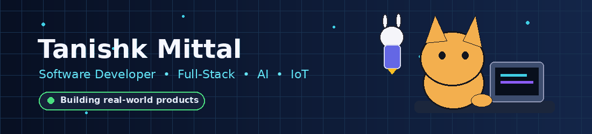
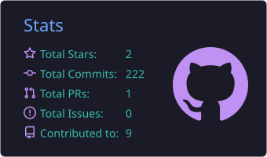
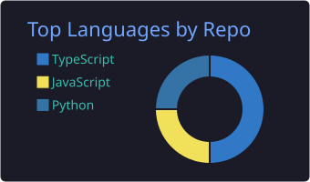
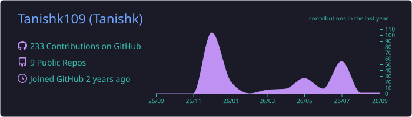

<div align="center">



<br/>


<br/>


&nbsp;&nbsp;&nbsp;

&nbsp;&nbsp;&nbsp;


<br/><br/>

[](https://www.linkedin.com/in/tanishk-mittal-10112004pm/)
[](https://leetcode.com/u/rNNGImiLvA/)
[](https://www.instagram.com/tqnishk.hehe/)
[](mailto:tanishk10112004@gmail.com)

<br/>


</div>

---

## 👨‍💻 About Me

```ts
const tanishk = {
  careerTracks: [
    "Software Development",
    "Product Management",
    "Product Analytics"
  ],

  education: "B.Tech CSE (IoT & Intelligent Systems) @ MUJ",

  focus: [
    "Full-Stack Systems",
    "Product Strategy",
    "Analytics",
    "AI Integration",
    "IoT"
  ],

  building: [
    "Real-Time Platforms",
    "Research Tools",
    "Operational Systems"
  ],

  learning: [
    "System Design",
    "Cloud Engineering",
    "Agentic AI"
  ],

  approach: "Build useful products, not just demos"
};
```

- 🎓 B.Tech CSE student specialising in **IoT and Intelligent Systems** at Manipal University Jaipur
- 💻 **Software Development Engineer Intern — Zidio Development, May–July 2026**
- 🧠 Interested in full-stack engineering, product strategy, analytics, AI-integrated products and research-oriented applications
- 🏆 Dean’s List awardee for **6 consecutive semesters**
- 🎓 Dr. TMA Pai Merit Scholarship recipient for **3 academic years**
- 🚀 Convenor of **International Innovation Challenge 2.0**
- 🤝 General Secretary, **IEEE WIE MUJ**

---

## 📦 Product Management & Analytics

I work at the intersection of **technology, users and business outcomes**—translating real problems into structured product requirements, prioritised features and measurable workflows.

<table>
<tr>
<td width="50%" valign="top">

### 🧭 Product Management

- User research and problem discovery
- Persona mapping and user-journey design
- Product requirements and feature scoping
- Prioritisation using **RICE** and **MoSCoW**
- Roadmap thinking and stakeholder coordination
- Success metrics and adoption hypotheses
- Generative and Agentic AI product exploration

</td>

<td width="50%" valign="top">

### 📈 Product & Business Analytics

- Funnel and conversion analysis
- Engagement, adoption and retention KPIs
- A/B-testing frameworks and hypothesis design
- Market and competitor research
- Operational analysis using SQL and spreadsheets
- Dashboard design and insight communication
- Data-informed feature evaluation

</td>
</tr>
</table>

### 🔎 Product Thinking in My Projects

- **MUJ Research Portal:** Defined three user personas, mapped student and faculty journeys, identified discovery and application friction, and proposed product-success metrics.
- **NRCMS:** Modelled role hierarchies and operational workflows for patient records, rehabilitation progress, centre operations and distributed administration.
- **IntellMeet:** Worked across feature scoping, API design, real-time collaboration, AI meeting intelligence and deployment decisions.
- **International Innovation Challenge 2.0:** Led end-to-end planning and operations for a 36-hour event involving a 150+ member team and 1,200+ registrations.

**Product toolkit:** `SQL` `Python` `Excel` `Google Sheets` `Figma` `Notion` `RICE` `MoSCoW` `Funnel Analysis` `A/B Testing`

---

## 🚀 Featured Work

### 🎥 [IntellMeet](https://github.com/Tanishk109/intellmeet) — AI-Powered Meeting & Collaboration Platform

A full-stack workspace combining browser-based meetings, real-time messaging, recordings, transcripts, AI summaries, action items, task management and analytics.

**Engineering highlights:** WebRTC video meetings · Socket.IO signalling and chat · JWT authentication · AI-assisted summaries · Dockerised backend · CI/CD

**Stack:** `React` `TypeScript` `Node.js` `Express.js` `MongoDB` `Socket.IO` `WebRTC` `OpenAI API` `Docker`

[](https://intellmeet-cqas.vercel.app)
[](https://github.com/Tanishk109/intellmeet)

---

### 🔬 [MUJ Research Collaboration Portal](https://github.com/Tanishk109/research-portal-2)

A role-based platform connecting faculty-led research opportunities with students seeking meaningful academic projects.

**Engineering highlights:** Student and faculty dashboards · Email verification · JWT sessions · Project discovery · Application tracking · MongoDB-backed workflows

**Stack:** `Next.js` `TypeScript` `MongoDB` `Mongoose` `JWT` `Tailwind CSS` `shadcn/ui`

[](https://research-portal-2-tvgq.onrender.com)
[](https://github.com/Tanishk109/research-portal-2)

---

### 🏥 [NRCMS](https://github.com/Tanishk109/rehabilitation-centre-tracking) — Rehabilitation Centre Management System

A centralised operations platform for patient records, treatment tracking, centre administration, orders and support workflows.

**Engineering highlights:** Role-based dashboards · Patient lifecycle tracking · Orders and acknowledgement workflows · Centre administration · Secure sessions

**Stack:** `Next.js` `TypeScript` `MongoDB` `React` `Radix UI` `bcrypt` `Vercel`

[](https://rehabilitation-centre-tracking.vercel.app)
[](https://github.com/Tanishk109/rehabilitation-centre-tracking)

---

### 🎯 [GoalTrack Pro](https://github.com/Tanishk109/goaltrack)

A role-aware goal-setting and achievement platform with approvals, quarterly tracking, analytics, audit trails and reporting.

**Stack:** `JavaScript` `Node.js` `Express.js` `MongoDB` `JWT` `SheetJS`

[](https://peaceful-biscuit-a774c4.netlify.app)
[](https://github.com/Tanishk109/goaltrack)

---

## 🛠️ Tech Stack

<details open>
<summary><b>⚡ Languages</b></summary>

<br/>


</details>

<details open>
<summary><b>🎨 Frontend</b></summary>

<br/>


</details>

<details open>
<summary><b>⚙️ Backend, Databases & Real-Time Systems</b></summary>

<br/>


</details>

<details open>
<summary><b>🤖 AI, DevOps & Tools</b></summary>

<br/>


</details>

---

## 📊 GitHub Analytics

<div align="center">





<br/><br/>



<br/><br/>


<br/><br/>


</div>

---

## 🧩 LeetCode

<div align="center">

<a href="https://leetcode.com/u/rNNGImiLvA/">
  
</a>

</div>

---

## 🌱 Current Focus

```text
Building    Full-stack products and intelligent applications
Learning    Product strategy, analytics, system design and Agentic AI
Exploring   AI products, user behaviour and scalable architectures
Practising  Data Structures and Algorithms in Java
```

<div align="center">


&nbsp;&nbsp;&nbsp;

&nbsp;&nbsp;&nbsp;


</div>

---

## 🤝 Let's Connect

<div align="center">

Open to software-development opportunities, technical collaborations, research projects and conversations about building meaningful products.

<br/><br/>

[](https://www.linkedin.com/in/tanishk-mittal-10112004pm/)
[](https://leetcode.com/u/rNNGImiLvA/)
[](https://www.instagram.com/tqnishk.hehe/)
[](mailto:tanishk10112004@gmail.com)

<br/><br/>

### `</> Build • Learn • Improve • Repeat`

</div>
